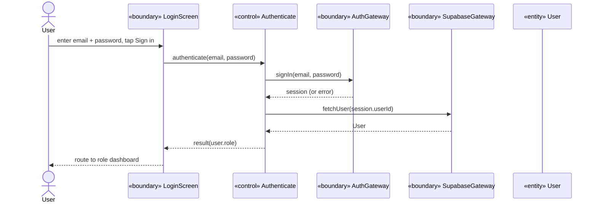
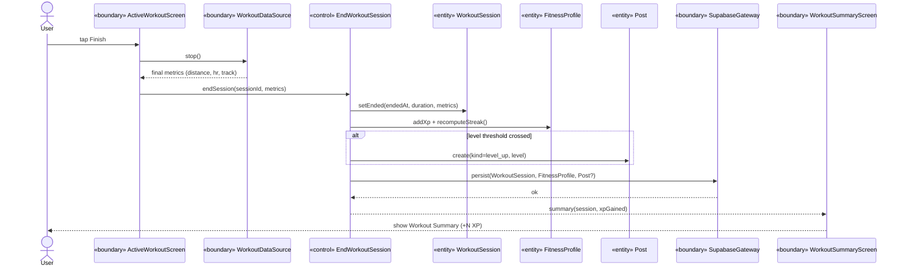
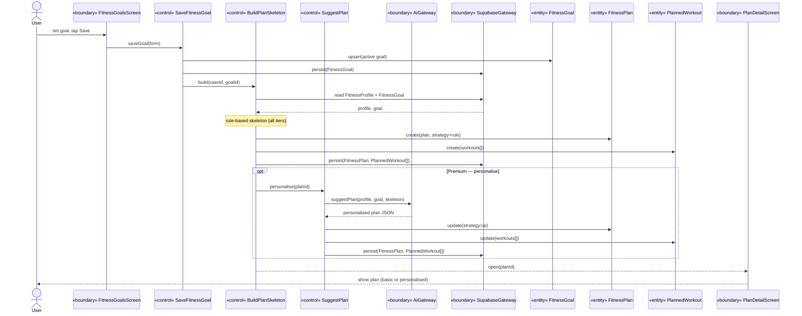
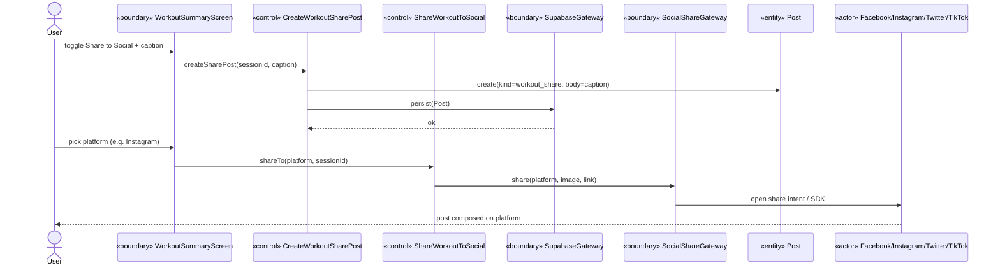
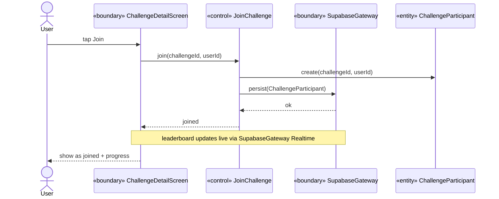
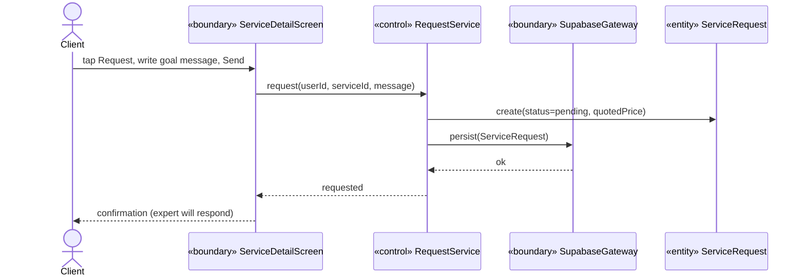
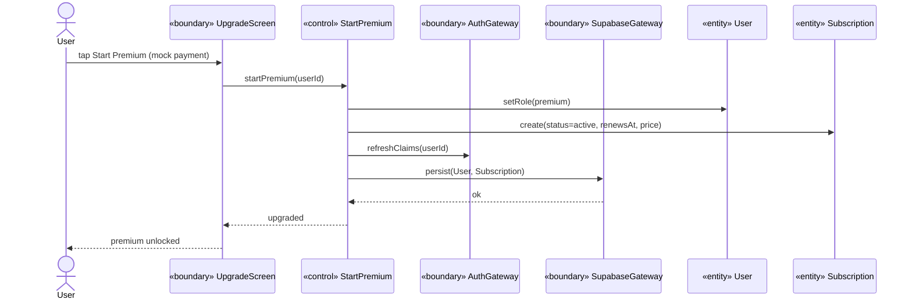

# Wise Workout — BCE Design (Boundary · Control · Entity)

The architecture and robustness/sequence analysis for the Flutter app, following **Jacobson's BCE (Boundary–Control–Entity)** stereotypes. Companion to [build-plan.md](build-plan.md); data model is [database-v1.md](../reference/database-v1.md).

**How to read this doc**

1. §1 — the three stereotypes and the collaboration rules examiners check.
2. §2 — the full BCE inventory (every Entity, Boundary, Control in the app).
3. §3 — the traceability matrix: use case → actor → boundary → control → entities → gateway.
4. §4 — **robustness diagrams** (analysis) per core use case.
5. §5 — **sequence diagrams** (design) per core use case, in Mermaid so they render/draw directly.
6. §6 — a runtime **logging convention** so the live app emits its own message sequences for diagram validation.

---

## 1. Stereotypes & collaboration rules

| Stereotype | Responsibility | Lives in |
|---|---|---|
| **Entity** | Persistent domain data + invariants that belong to the data | `lib/entities/` (freezed models of the 26 schema entities) |
| **Boundary** | The system edge — talks to an **actor** (UI) or an **external system** (gateway) | `lib/boundaries/ui/`, `lib/boundaries/gateways/` |
| **Control** | Coordinates exactly **one use case**; the verb logic mediating boundary ↔ entity | `lib/controls/` (one class per use case = the mock's store actions) |

**Two flavours of Boundary** (the distinction most students miss):

- **UI boundary** — actor-facing screens/widgets (e.g. `ActiveWorkoutScreen`).
- **Gateway boundary** — external-system-facing adapters (DB, AI, sensors, social, notifications).

### The collaboration rule (graded)

```
Actor ── Boundary ── Control ── Entity
```

| From → To | Allowed? |
|---|---|
| Actor → Boundary(UI) | ✅ |
| Boundary(UI) → Control | ✅ |
| Control → Entity | ✅ |
| Control → Boundary(gateway) | ✅ |
| Control → Control | ✅ |
| Control → Boundary(UI) (return/update) | ✅ |
| Boundary → Entity (direct) | ❌ |
| Entity → Boundary | ❌ |
| Boundary(UI) → Boundary(UI) | ❌ |
| Entity → Entity | ❌ (mediate via a Control) |
| Control → Actor | ❌ |

**The one sentence:** a screen never touches an entity or the database directly — it always goes through a Control. That discipline *is* BCE, and Riverpod implements it (a Control is a `Notifier`/use-case class the UI watches).

---

## 2. BCE inventory

### 2.1 Entities (`lib/entities/`)

The 26 schema entities, grouped. Each is a freezed model; data-owned rules (e.g. XP/level/streak math) live with the entity or its Control per §1.

- **Identity & profile:** `User`, `FitnessProfile`, `ExpertProfile`, `Subscription`, `FitnessGoal`
- **Catalogs:** `WorkoutType`, `HealthTag`, `ExpertCategory`
- **Training:** `FitnessPlan`, `PlannedWorkout`, `WorkoutSession`, `ExerciseLog`, `ConnectedDevice`
- **Social:** `Post`, `PostLike`, `PostComment`, `Challenge`, `ChallengeParticipant`, `Follow`
- **Marketplace:** `ExpertService`, `ServiceRequest`, `Deliverable`, `ExpertReview`, `ExpertVerificationDocument`
- **Back-office:** `Feedback`, `ContactMessage`

> **AI scope note (SRS §3.9, TDM §3.4):** the `AiGateway` covers only **progress summaries** + **plan suggestions**. Reminders/inactivity/rest alerts and the basic plan skeleton are **rule-based** Controls (no AI). Coaching/custom plans are **human-expert** (the `Deliverable` flow). Plans (UPDATED 12 Jun, recon log C4-cancelled): **both tiers get AI plans** via the suggest-plan Edge Function (Free basic depth, Premium personalised), realized as one `GeneratePlan` control with `BuildPlanSkeleton` as the rule-based offline fallback; `SummariseProgress` is the AI summary control. The §2.4 control list, §3 traceability matrix, and §4.2/§5.3 diagrams are all aligned to this.

### 2.2 Gateway boundaries (`lib/boundaries/gateways/`)

| Gateway | External system | Used by (controls) |
|---|---|---|
| `SupabaseGateway` | Postgres DB (CRUD + RPC + Realtime) | nearly all |
| `AuthGateway` | Supabase Auth | Authenticate, RequestPasswordReset, StartPremium |
| `AiGateway` | OpenAI (Gemini fallback) via Edge Function | SummariseProgress, SuggestPlan |
| `WorkoutDataSource` | Phone sensors (`geolocator`/`pedometer`); later BLE/Health | StartWorkoutSession, EndWorkoutSession |
| `SocialShareGateway` | Facebook / Instagram / Twitter / TikTok | ShareWorkoutToSocial |
| `NotificationGateway` | `flutter_local_notifications` (later FCM) | ScheduleReminder |
| `StorageGateway` | Supabase Storage | avatars, expert verification docs |

### 2.3 UI boundaries (`lib/boundaries/ui/`)

One screen component per mocked screen (see [screens/](../reference/screens/)). E.g. `LoginScreen`, `DashboardScreen`, `ActiveWorkoutScreen`, `WorkoutSummaryScreen`, `SocialFeedScreen`, `ChallengeDetailScreen`, `ServiceDetailScreen`, `UpgradeScreen`, …

### 2.4 Controls (`lib/controls/`) — the use cases

Each is one of the mock's store actions = one use case = one Control class.

| Feature | Controls |
|---|---|
| Auth | `Authenticate`, `RequestPasswordReset` |
| Profiling | `UpsertFitnessProfile`, `ToggleHealthTag`, `ToggleWorkoutPreference`, `SaveFitnessGoal`, `UpdateNotificationPrefs`, `UpdateAccountSettings` |
| Plans | `GeneratePlan` (AI both tiers — realizes `SuggestPlan`; `BuildPlanSkeleton` rule fallback), `RegeneratePlan` (Plan Detail; Free capped at 1) |
| AI summaries | `SummariseProgress` (AI) |
| Devices | `ManageConnectedDevice` |
| Capture | `StartWorkoutSession`, `EndWorkoutSession`, `LogExercise`, `UpdateWorkoutSession` |
| Social | `CreateWorkoutSharePost`, `UpdatePostBody`, `DeletePost`, `TogglePostLike`, `AddPostComment`, `DeletePostComment`, `FollowUser`, `UnfollowUser` |
| Challenges | `CreateChallenge`, `JoinChallenge`, `LeaveChallenge` |
| Marketplace (client) | `ToggleFollowExpert`, `RequestService`, `SubmitReview` |
| Marketplace (expert) | `PublishService`, `AcceptServiceRequest`, `SendDeliverable`, `CompleteServiceRequest` |
| Feedback | `SubmitFeedback` |
| Subscription | `StartPremium`, `CancelSubscription`, `Resubscribe` |
| Admin | `SetUserStatus`, `ReviewExpertVerification`, `TriageFeedback`, `ResolveContactMessage` |

> **As-built (vertical slice).** §2.2–§2.4 are the full design for all 64 use cases; the shipped vertical slice implements a subset, with two deliberate realizations:
> - **Gateways:** the logical `SupabaseGateway` is realized as **seven feature gateways** — `ProfileGateway`, `WorkoutGateway`, `SocialGateway`, `FitnessGateway`, `PlanGateway`, `FeedbackGateway`, `DeviceGateway` (plus the as-designed `AuthGateway`, `AiGateway`, `WorkoutDataSource` incl. `WearableHrSource`/`CompositeWorkoutDataSource`, `SocialShareGateway`). `NotificationGateway` / `StorageGateway` are not built yet.
> - **Controls built (12 Jun):** `Authenticate`, `RequestPasswordReset`, `ActiveWorkout` (realizes `StartWorkoutSession` + `EndWorkoutSession`, calls the `end_workout_session` RPC, links sessions to their source device), `SaveWorkoutDetails`, `DeleteWorkoutSession`, `SummariseProgress`, `CreateWorkoutSharePost`, `ShareWorkoutToSocial`, `GeneratePlan` + `CompleteOnboarding`, `ManageConnectedDevice`, `UpsertFitnessProfile` (as `UpdateFitnessProfile`), `SetFitnessGoal`, `UpdateAccountSettings`, `ManageNotificationPrefs`, `SubmitFeedback`, `ViewProfile` (read-side).
> - **Social + challenge controls built (6 Jul):** `TogglePostLike`, `AddPostComment`, `DeletePostComment`, `UpdatePostBody`, `FollowUser`/`UnfollowUser` (realized as the mutual-pair `add_friend`/`remove_friend` SECURITY DEFINER RPCs — `follows` RLS can't write the reciprocal row client-side), `JoinChallenge`, `LeaveChallenge`, `CreateChallenge` (creator auto-joins), plus read controls `ViewSocialFeed` (`feedProvider`), `ViewPostDetail`/`ListPostComments`, `ManageFriends` providers, `ViewChallenges` (assembles cards from `challenge_leaderboards(uuid[])`, the live-aggregation SQL fn over `public_workout_sessions`). `DeletePost` exists gateway-side (un-share path; no feed UI by design). Pending: admin controls.
> - **Marketplace controls built (7 Jul):** client `ToggleFollowExpert` (bookmark array on profiles), `RequestService` (§5.6, price snapshot), `SubmitReview` (RPC-gated); expert `AcceptServiceRequest`/`DeclineServiceRequest`/`SendDeliverable`/`CompleteServiceRequest` — realized as SECURITY DEFINER RPCs + a grants lockdown (direct status writes revoked). **Realization note:** expert accounts get a dedicated shell with its own bottom nav (Home · Services · Requests · Clients · Profile — the #20–#24 track, built directly against the schema like the mock): dashboard w/ reputation + workload, read-only services list, a triage-only request inbox (accept/decline; active rows link onward), a clients roster split Active/Past, and an expert profile tab. Per the fulfillment model, deliverables are sent and engagements marked complete on **#23.1 Client Detail** (`ExpertClientDetailScreen`, reached from #23 or from an accepted row on #22) — not on the Requests tab. **Completed 8 Jul:** `PublishService` (#21.2 `ServiceEditorScreen` — create/edit/status incl. draft→live→archived) and `UpdateExpertProfile` (#24.1 `ProfessionalInfoScreen`; SEQ `publish-service` / `manage-professional-info`). The expert-profile aggregate + verification columns are column-grant-revoked — self-service edits reach only the five descriptive columns; aggregates change solely via the RPCs.
> - **Premium controls built (8 Jul):** `StartPremium` (the simulated Free→Premium upgrade — `start_premium` SECURITY DEFINER RPC flips `role` and upserts the `Subscription` row; the role-guard trigger admits it via a transaction-local flag, so direct client role writes stay blocked) + `ManageSubscription` (#13.6 cancel/resume — owner-scoped status writes under the `subscriptions_owner` RLS policy, deliberately not RPCs). Boundaries: `UpgradeScreen` (#16, with the simulated-payment sheet) and `SubscriptionManagementScreen` (#13.6). SEQ ids `start-premium`, `manage-subscription`, `view-subscription`.
> - **Sequence-diagram note:** §5.4 (share) and §5.5 (join challenge) now have running counterparts; like/comment/follow/create-challenge flows follow the same Boundary→Control→Gateway shape and are SEQ-logged with use-case ids `toggle-like`, `add-comment`, `follow-user`, `join-challenge`, `create-challenge`, `view-feed`, `view-challenges`; marketplace flows use `browse-experts`, `request-service`, `submit-review`, `view-requests`, `accept-request`, `decline-request`, `send-deliverable`, `complete-request`, `toggle-follow-expert`.

---

## 3. Traceability matrix

Use case → Actor → UI boundary → Control → Entities (R=read, W=write) → Gateway. Drawn from the screen→data map in [database-v1.md](../reference/database-v1.md). (Core rows shown; the remaining controls in §2.4 follow the same shape.)

| Use case | Actor | UI boundary | Control | Entities (R/W) | Gateway |
|---|---|---|---|---|---|
| Log in | Free/Premium/Expert/Admin | `LoginScreen` | `Authenticate` | `User` (R) | `AuthGateway`, `SupabaseGateway` |
| Set fitness goal | Free/Premium | `FitnessGoalsScreen` | `SaveFitnessGoal` | `FitnessGoal` (W) | `SupabaseGateway` |
| Build basic plan | Free/Premium | `PlanDetailScreen` | `BuildPlanSkeleton` (rule-based) | `FitnessProfile`(R), `FitnessGoal`(R), `FitnessPlan`(W), `PlannedWorkout`(W) | `SupabaseGateway` |
| Suggest personalised plan | Premium | `PlanDetailScreen` | `SuggestPlan` (AI) | `FitnessProfile`(R), `FitnessGoal`(R), `FitnessPlan`(W), `PlannedWorkout`(W) | `AiGateway`, `SupabaseGateway` |
| Summarise progress | Free/Premium | `HistoryScreen` | `SummariseProgress` (AI) | `WorkoutSession`(R), `FitnessGoal`(R) | `AiGateway`, `SupabaseGateway` |
| Record workout | Free/Premium | `ActiveWorkoutScreen` | `StartWorkoutSession` → `EndWorkoutSession` | `WorkoutSession`(W), `FitnessProfile`(W), `Post`(W) | `WorkoutDataSource`, `SupabaseGateway` |
| Share workout | Free/Premium | `WorkoutSummaryScreen` | `CreateWorkoutSharePost` → `ShareWorkoutToSocial` | `Post`(W), `WorkoutSession`(R) | `SupabaseGateway`, `SocialShareGateway` |
| Join challenge | Free/Premium | `ChallengeDetailScreen` | `JoinChallenge` | `Challenge`(R), `ChallengeParticipant`(W) | `SupabaseGateway` |
| Request expert service | Free/Premium | `ServiceDetailScreen` | `RequestService` | `ExpertService`(R), `ServiceRequest`(W) | `SupabaseGateway` |
| Send deliverable | Expert | `ClientDetailScreen` | `SendDeliverable` | `ServiceRequest`(R), `Deliverable`(W) | `SupabaseGateway` |
| Upgrade to premium | Free | `UpgradeScreen` | `StartPremium` | `User`(W), `Subscription`(W) | `AuthGateway`, `SupabaseGateway` |
| Suspend a user | Admin | `UserDetailScreen` | `SetUserStatus` | `User`(W) | `SupabaseGateway` |
| Submit feedback | any | `SubmitFeedbackScreen` | `SubmitFeedback` | `Feedback`(W) | `SupabaseGateway` |

---

## 4. Robustness diagrams (analysis)

Conventions: `(A)` actor · `[B]` boundary · `<C>` control · `{E}` entity. Every arrow obeys §1.

### 4.1 End Workout Session

```
(User) → [ActiveWorkoutScreen] → <EndWorkoutSession>
   <EndWorkoutSession> updates {WorkoutSession}        (EndedAt, duration, metrics)
   <EndWorkoutSession> updates {FitnessProfile}        (TotalXp, CurrentStreak)
   <EndWorkoutSession> may create {Post}               (level_up if threshold crossed)
   <EndWorkoutSession> persists via [SupabaseGateway]
   <EndWorkoutSession> → [WorkoutSummaryScreen] → (User)
```

> **12 Jun update:** the robustness/sequence analyses below were drawn when plan AI was
> Premium-only. As built, **both tiers** call `suggestPlan` (Free basic / Premium personalised)
> through the single `GeneratePlan` control; `BuildPlanSkeleton` is the offline fallback.
> Treat "Premium only" annotations in §4.2/§5.3 as superseded.

### 4.2 Suggest Fitness Plan (rule skeleton + AI personalisation)

```
(User) → [FitnessGoalsScreen] → <SaveFitnessGoal> → updates {FitnessGoal} → [SupabaseGateway]
<SaveFitnessGoal> → <BuildPlanSkeleton>                 (rule-based, all tiers)
   <BuildPlanSkeleton> reads {FitnessProfile}, {FitnessGoal}
   <BuildPlanSkeleton> creates {FitnessPlan}, {PlannedWorkout}* → [SupabaseGateway]
   (Premium only) <SuggestPlan> personalises the skeleton via [AiGateway]
   <SuggestPlan> updates {FitnessPlan}, {PlannedWorkout}* → [SupabaseGateway]
   → [PlanDetailScreen] → (User)
```

### 4.3 Share Workout to Social

```
(User) → [WorkoutSummaryScreen] → <CreateWorkoutSharePost>
   <CreateWorkoutSharePost> creates {Post} (kind=workout_share) → [SupabaseGateway]
(User) picks platform → <ShareWorkoutToSocial>
   <ShareWorkoutToSocial> reads {WorkoutSession}
   <ShareWorkoutToSocial> → [SocialShareGateway] → (Facebook/Instagram/Twitter/TikTok)
```

### 4.4 Join Challenge · 4.5 Request Service · 4.6 Start Premium

```
(User) → [ChallengeDetailScreen] → <JoinChallenge> → creates {ChallengeParticipant} → [SupabaseGateway]
(User) → [ServiceDetailScreen]   → <RequestService> → creates {ServiceRequest} (pending) → [SupabaseGateway]
(User) → [UpgradeScreen]         → <StartPremium>   → updates {User}, creates {Subscription} → [AuthGateway],[SupabaseGateway]
```

---

## 5. Sequence diagrams (design)

Mermaid `sequenceDiagram` source — renders in VS Code (Markdown Preview Mermaid), GitHub, and most UML tools (or paste into mermaid.live / convert to PlantUML for the TDM). Participants carry their stereotype.

### 5.1 Authenticate (log in)



### 5.2 End Workout Session



### 5.3 Suggest Fitness Plan (rule skeleton + AI personalisation)



### 5.4 Share Workout to Social



### 5.5 Join Challenge



### 5.6 Request Expert Service



### 5.7 Start Premium



---

## 6. Logging convention — emit sequences from the running app

To **draw sequence diagrams from real runs** (and validate the §5 designs against actual behaviour), instrument the Control layer so every use case logs its own messages in a parseable format. Because BCE funnels all logic through Controls, logging *there* captures the whole sequence.

**Log line format** (one per message):

```
SEQ <useCaseId> <from> -> <to> : <message>
```

Example emitted by `EndWorkoutSession`:

```
SEQ end-workout ActiveWorkoutScreen -> EndWorkoutSession : endSession(s1, metrics)
SEQ end-workout EndWorkoutSession  -> WorkoutSession     : setEnded(...)
SEQ end-workout EndWorkoutSession  -> FitnessProfile     : addXp(45)
SEQ end-workout EndWorkoutSession  -> SupabaseGateway    : persist(...)
SEQ end-workout EndWorkoutSession  -> WorkoutSummaryScreen : summary(+45 XP)
```

**Implementation:** a tiny `SeqLog.msg(useCase, from, to, message)` helper (a Riverpod-injected logger), called at the start of each Control method and before each gateway/entity interaction. Wrap it in a `kDebugMode` guard so it's stripped from release builds.

**Drawing from the log:** filter by `useCaseId`, then map each `from -> to : message` line to a Mermaid `from->>to: message` line — a ~20-line script regenerates the diagram, so your documented sequences always match the implemented ones. This closes the loop between design (§5) and the built app, which is exactly the kind of design↔implementation traceability an FYP TDM rewards.
