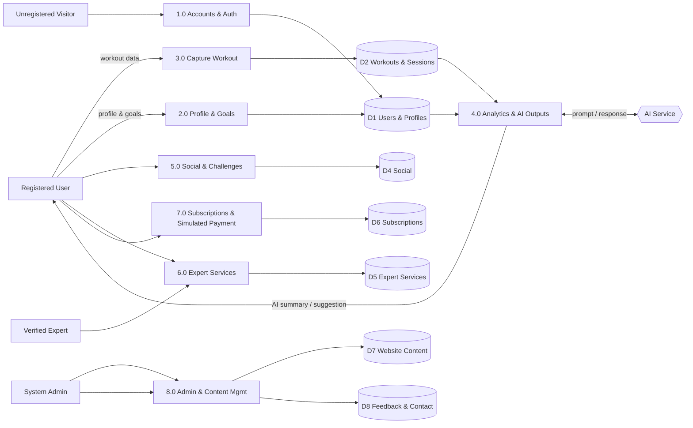

# PTD — Net-New Sections (drop-in drafts)

Draft content for the PTD sections that aren't already in the PRD/SRS/TDM. Copy these into the Word template under the matching section number, then adjust wording to the team voice. Diagrams (DFD) are given as both a renderable form and a redraw spec so they can be drawn in draw.io to match the TDM's notation.

Sourcing: derived from **PRD v2.0** (market research, value prop, schedule, roles, risk), **SRS v2.0** (use cases, NFRs), and **TDM v3.0** (architecture, ERD, DFD context diagram). Reconcile any figures against the [reconciliation log](doc-reconciliation-log.md) before final render (e.g. premium price = **$9.99/mo**).

---

## §2.4 SWOT Analysis

Strategic position of Wise Workout as a Final Year Project product concept.

| | **Helpful** | **Harmful** |
|---|---|---|
| **Internal** | **Strengths** | **Weaknesses** |
| **External** | **Opportunities** | **Threats** |

### Strengths
- **Integrated platform** — workout tracking, AI-assisted progress summaries, AI plan suggestions, a verified human-expert marketplace, and a social/challenge layer in **one** cross-platform app, rather than forcing users to stitch together several single-purpose apps.
- **Three-layer business model** — Free, Premium, and an à-la-carte **expert-services layer** that both Free and Premium users can buy, giving multiple revenue paths without paywalling human expertise behind the Premium tier.
- **AI used responsibly** — AI scope is deliberately limited to summaries and plan *suggestions*; coaching and custom plans come from verified human experts, and all AI output is labelled AI-assisted (never medical advice), reducing liability and building trust.
- **Modular, extensible architecture** — a managed backend (Supabase) and a clean sensor abstraction mean wearables/HealthKit, BLE heart-rate, and push notifications can be added later as new modules rather than rewrites.
- **Disciplined engineering design** — a Boundary–Control–Entity architecture with traceable use cases, sequence diagrams, and role-based + row-level access control.

### Weaknesses
- **Resource and time constraints** of an FYP (4-person team, two terms) limit the depth of advanced features; some capabilities (payment, wearable sync) are delivered at a **simulated or conceptual** level.
- **No existing user base or brand recognition** — the platform starts from zero against established incumbents.
- **Dependence on third-party services** (OpenAI/Gemini, Supabase) for core functionality, exposing the product to their pricing, availability, and policy changes.
- **Narrow initial AI capability** by design — users expecting full AI coaching may perceive the summaries/suggestions as limited.
- **Expert marketplace needs supply** — value depends on attracting verified experts, a two-sided-market cold-start challenge.

### Opportunities
- **Growing fitness-app and wearable market** with rising consumer demand for data-driven and AI-assisted training.
- **Underserved gap** — most mainstream apps offer tracking *or* AI plans *or* coaching, but few connect users to **verified human experts** inside the same app; this is the differentiator.
- **Regional health-tech momentum** (Singapore's digital-health and preventive-health push) supports adoption.
- **Clear expansion paths** — wearable/HealthKit integration, nutrition tracking, corporate-wellness packages, and additional expert categories.

### Threats
- **Strong incumbents** — Strava, MyFitnessPal, adidas Running, Google Fit, Freeletics, MapMyFitness compete on tracking, analytics, or AI plans.
- **Platform and SDK risk** — changes to social-sharing APIs (Facebook/Instagram/Twitter/TikTok), HealthKit/Health Connect, or app-store policies can break features.
- **Data-privacy regulation** — fitness and health data are sensitive under PDPA and app-store health-data rules; non-compliance is a material risk (see §9.2).
- **AI cost and policy volatility** — provider price increases or usage-policy changes could affect the AI features.
- **User trust** — scepticism toward AI guidance for health-adjacent decisions.

---

## §2.5 Unique Selling Point (USP)

> **Wise Workout is the only app in its class that combines automated phone-sensor workout tracking, AI-assisted progress summaries and plan suggestions, and a marketplace of *verified human experts* — in one cross-platform app, with expert services sold à la carte rather than locked behind a subscription.**

**Why it's unique — the competitor gap (PRD §2.2–2.4):**

| Capability | Strava | MyFitnessPal | Freeletics | **Wise Workout** |
|---|---|---|---|---|
| Workout tracking from phone sensors | ✅ | Partial | ✅ | ✅ |
| AI progress summaries + plan suggestions | ❌ | ❌ | ✅ (plans) | ✅ |
| **Verified human-expert services in-app** | ❌ | ❌ | ❌ | ✅ |
| Social feed + challenges | ✅ | Partial | Partial | ✅ |
| Expert services à la carte (not bundled into premium) | — | — | — | ✅ |

**The single sentence for the pitch:** *Wise Workout bridges automated insight and human expertise — the app summarises and suggests, while real verified experts coach — so users get both the convenience of AI and the credibility of a professional, clearly separated and clearly labelled.*

---

## §5.4 Project Charter

| Field | Detail |
|---|---|
| **Project name** | Wise Workout — A Mobile Application for Wise Workout |
| **Project code** | CSIT-26-S2-05 · Group FYP-26-S2-37 |
| **Module** | CSIT321 Final Year Project (UOW / SIM) |
| **Supervisor** | Mr Premrajan |
| **Duration** | 4 Apr 2026 – 22 Aug 2026 (two terms) |
| **Project manager / coordinator** | Chia Yuan Jun |
| **Purpose** | Deliver a cross-platform mobile fitness application that integrates workout tracking, AI-assisted progress summaries and plan suggestions, a verified-expert services marketplace, and a social/challenge layer, supported by a marketing website and an admin portal. |
| **Objectives** | (1) Build the core capture → analyse → AI-summary → share loop. (2) Implement all five user roles. (3) Deliver Free/Premium/Expert-services monetisation (simulated payment). (4) Apply a maintainable BCE architecture with role-based + row-level security. (5) Produce the required FYP deliverables (PRD, SRS, TDM, PTD, PUM, final system + demo). |
| **In scope** | Mobile app (Android + iOS via Flutter); marketing website; admin portal; phone-sensor + manual workout capture; AI summaries/suggestions via a secure backend function; expert listings, requests, and deliverables; social feed, challenges, friends; subscriptions; admin user/expert/content moderation. |
| **Out of scope (this project phase)** | Real payment-gateway settlement (simulated only); live wearable/HealthKit/BLE sync (architecturally provisioned, additive later); push/FCM notifications (local notifications only initially); nutrition tracking; non-English localisation. |
| **Key deliverables** | PRD, SRS, TDM, **PTD + PUM (≈13 Jun)**, End-of-Term-1 review (20 Jun), module + integration testing, final working system and demonstration (13–22 Aug). |
| **Stakeholders** | Project team (4), supervisor/assessors (UOW/SIM), prospective end users (free/premium/expert), evaluators. |
| **Team & roles (PRD §8.4)** | Chia Yuan Jun — coordination & documentation; Devanandi Praveen — mobile / UI; Foong Jun Yan — backend / database / API; Jedidiah Goh — website / expert & admin features. |
| **Success criteria** | Core vertical slice demonstrable end-to-end; all five roles functional; deliverables submitted on schedule and internally consistent; architecture and security requirements met; positive supervisor/assessor evaluation. |
| **Top constraints** | Fixed FYP timeline and team size; reliance on third-party services (Supabase, OpenAI/Gemini); iOS build/test requires Mac + device. |
| **Top assumptions** | Users have compatible smartphones + connectivity; third-party services remain available within budget; wearables (if used later) support standard data-sharing. |

---

## §5.5 Communication Management Plan

**Objective:** keep the team, supervisor, and documents synchronised, and define how decisions and changes are recorded.

### Stakeholders & channels
| Stakeholder | Primary channel | Cadence |
|---|---|---|
| Project team (internal) | Team chat (WhatsApp/Discord) | Daily / as needed |
| Team working sessions | Video call + screen share | 1–2× per week |
| Supervisor (Mr Premrajan) | Scheduled meetings + email | Weekly / fortnightly per milestone |
| Code collaboration | GitHub (repo, issues, pull requests) | Continuous |
| Documents & assets | Shared drive (Word deliverables, diagrams, wireframes) | Continuous |
| Assessors / evaluators | Formal submissions + presentations | At each milestone |

### Meeting types
- **Weekly team sync** — progress, blockers, next-sprint tasks (Agile; PRD §10.3).
- **Supervisor meeting** — milestone review, feedback, sign-off before each submission.
- **Ad-hoc design huddles** — for architecture/scope decisions.

### Escalation path
Team member → project coordinator (Yuan Jun) → supervisor. Technical blockers older than ~2 working days are escalated at the weekly sync.

### Document & change control
- Every deliverable carries a **version-control table** (version, date, author, description) — as in the TDM.
- Engineering decisions that diverge from a submitted document are recorded in the **[document reconciliation log](doc-reconciliation-log.md)** and folded into the next revision of the affected doc.
- Major scope or architecture changes require team agreement at a sync and supervisor awareness at the next meeting.

---

## §9.2 Legal & Regulatory Considerations

The system handles personal and fitness/health-related data and integrates with third-party platforms; the following obligations apply.

| Area | Consideration | How the design addresses it |
|---|---|---|
| **Personal data (PDPA, Singapore)** | Collection, use, storage, and disclosure of personal data require consent and a lawful purpose; users have rights to access and correction. | Consent at registration; collect only what features need; account/profile data is access-controlled (role-based + row-level security); accounts can be suspended/removed. |
| **Health & fitness data sensitivity** | Workout, heart-rate, and body metrics are sensitive and demand stronger protection. | Private-by-default records (e.g. `WorkoutSession.Notes` is always private); secure transport; least-privilege access; data minimisation. |
| **Not medical advice** | AI outputs and app guidance must not be presented as medical, nutritional, or clinical advice. | All AI output is labelled **AI-assisted**; coaching/custom plans come from verified human experts; an explicit "not medical advice" disclaimer; TDM §3.4 records this as a design constraint. |
| **App-store compliance** | Apple App Store & Google Play health-data, privacy-label, and content policies. | Permissions (location, motion, notifications) requested with rationale; privacy policy published; health-data guidelines followed. |
| **Social-platform terms** | Sharing to Facebook / Instagram / Twitter / TikTok must follow each platform's API and branding terms. | Use official share mechanisms; respect rate limits and branding; user-initiated sharing only. |
| **Third-party service terms** | OpenAI/Gemini usage policies; Supabase data-processing terms. | API keys kept server-side (Edge Function) — never shipped in the app; comply with provider acceptable-use policies; no sending of data the user hasn't consented to process. |
| **Payment** | Real payment handling carries PCI/financial-compliance obligations. | Payment is **simulated** for the FYP — no real card data is collected or stored, avoiding those obligations at this stage. |
| **Age / eligibility** | Fitness apps commonly restrict to users above a minimum age. | State a minimum-age requirement in the terms; out-of-scope features flagged accordingly. |

---

## §16.1 Data Flow Diagram (Level 1)

The **context (level-0) DFD already exists in TDM §3.3** (the "Wise Workout Platform Process" with Platform Users ↔ Process ↔ Server/Database). This is its **level-1 decomposition** — the single process expanded into its major sub-processes and data stores. Redraw in draw.io to match the TDM's notation.

### External entities
Unregistered Visitor · Registered User (Free/Premium) · Verified Expert · System Admin · AI Service (OpenAI/Gemini) · Wearable / Health APIs · Notification Service · Payment/Subscription Gateway (simulated)

### Processes
| ID | Process | Key inputs → outputs |
|---|---|---|
| 1.0 | Manage Accounts & Authentication | credentials, registration / expert application → auth result, account record |
| 2.0 | Manage Profile, Fitness Profile & Goals | profile + goal edits → stored profile, goal progress |
| 3.0 | Capture Workout (sensor / manual) | sensor + manual workout data, wearable sync → workout session |
| 4.0 | Generate Analytics & AI Outputs | workout history + goals → basic/advanced analytics, AI summary, AI/rule plan suggestion |
| 5.0 | Manage Social & Challenges | posts, likes, comments, challenge join/create, share → feed, challenge results |
| 6.0 | Manage Expert Services | listings, service requests, deliverables, reviews → service status, expert responses |
| 7.0 | Manage Subscriptions & (Simulated) Payment | tier change, simulated payment → subscription status |
| 8.0 | Admin & Content Management | user/expert moderation, verification, website-content edits, feedback/contact handling → admin dashboards, published content |

### Data stores
D1 Users & Profiles · D2 Workouts & Sessions · D3 Plans & Goals · D4 Social (Posts/Challenges) · D5 Expert Services (Listings/Requests/Deliverables/Reviews) · D6 Subscriptions · D7 Website Content · D8 Feedback & Contact Messages

*(Data stores map directly onto the TDM §8 ERD entities.)*

### Renderable sketch (Mermaid — for reference; redraw as a formal DFD)

---

## §18 Glossary

| Term | Definition |
|---|---|
| **BCE (Boundary–Control–Entity)** | An architecture pattern (Jacobson) separating actor-facing **Boundaries**, use-case **Controls**, and data **Entities**; the rule is Actor ─ Boundary ─ Control ─ Entity. |
| **Boundary** | A component at the system edge — a UI screen/widget or a system-facing gateway/adapter. |
| **Control** | A class implementing one use case; mediates between Boundaries and Entities. |
| **Entity** | A domain object holding data and data-owned rules (e.g. XP, level, streak). |
| **Gateway** | A system-facing boundary that talks to an external system (database, AI, sensors, social, notifications, storage). |
| **Supabase** | The managed backend: PostgreSQL database + Auth + Storage + Realtime + Edge Functions. |
| **Edge Function** | Server-side function (on Supabase) used to proxy the AI provider so the API key never ships in the app. |
| **RLS (Row-Level Security)** | Database rules that restrict which rows a user can read/write, enforcing privacy invariants (e.g. private workout notes). |
| **Flutter / Dart** | The cross-platform UI framework / language used to build the Android + iOS app from one codebase. |
| **Riverpod** | The app's state-management library; a Control is implemented as a Riverpod notifier the UI watches. |
| **go_router** | The routing library; handles role-based navigation/redirects. |
| **ERD (Entity-Relationship Diagram)** | The database design showing entities and their relationships (TDM §8). |
| **DFD (Data Flow Diagram)** | A model of how data moves between external entities, processes, and data stores (context in TDM §3.3; level-1 in §16.1). |
| **FR / NFR** | Functional Requirement (what the system does) / Non-Functional Requirement (quality attributes — security, performance, etc.). |
| **Use case** | A described interaction between an actor and the system to achieve a goal (SRS has 64). |
| **Three-layer model** | The business model: **Free**, **Premium**, and a separate à-la-carte **Expert-services** layer that both Free and Premium users can purchase. |
| **AI-assisted summary** | A machine-generated recap of a user's progress — informational, not medical advice. |
| **AI plan suggestion** | A machine-suggested training plan (Premium = personalised); distinct from human-expert custom plans. |
| **Suggested vs Freeform workout** | A workout started from a plan's prescribed session vs an unstructured one the user starts on the spot. |
| **Deliverable** | Content an expert produces for a client within a paid engagement (e.g. a form review or custom block). |
| **Service request** | A user's paid request against an expert's service listing. |
| **HR zone** | A heart-rate training band (e.g. Z1–Z5) used in advanced analytics. |
| **Training Effect** | A score estimating a session's training stimulus. |
| **ACWR (acute:chronic workload ratio)** | The "workload ratio" in advanced analytics — recent load vs longer-term baseline; flags over-/under-reaching. |
| **PDPA** | Singapore's Personal Data Protection Act, governing personal-data handling. |
| **Simulated payment** | Subscription/expert-service purchase flows modelled with price fields and status only — no real gateway or card data. |
