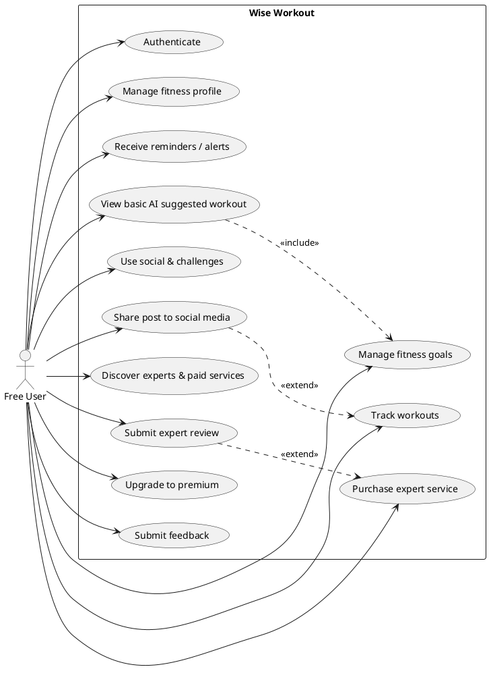
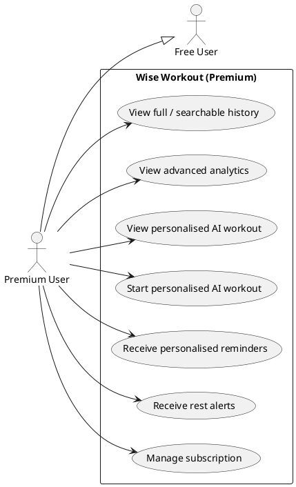
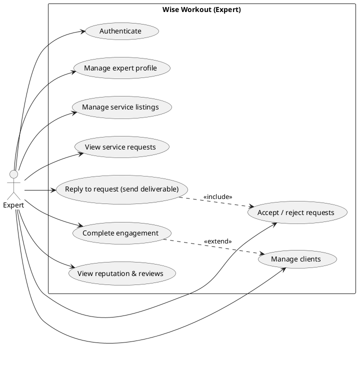
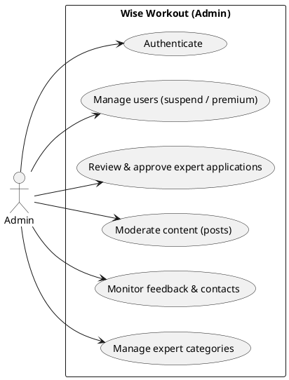

# Wise Workout — User Requirement Specification (URS)

> ⚠️ **DEPRECATED — superseded by the official SRS v2.0.** This file was a reconstruction built before the team's **SRS v2.0** was available. The SRS is the canonical requirements document — it has all 64 use cases with full descriptions plus FR/NFR tables with IDs. **Use the SRS, not this file**, for requirements. Kept only for the early scope-reconciliation notes below (some of which the SRS resolved differently — e.g. the marketing website and expert reviews *are* in the official scope). Do not cite this in the PTD; cite the SRS.

**Project:** CSIT-26-S2-05 — A Mobile Application for Wise Workout
**Group:** FYP-26-S2-37
**Supervisor:** Mr Premrajan P

> Structured to the FYP URS template. The **feature breakdown mirrors the team's functional-decomposition diagram** (the authoritative scope), with three deliberate retentions and one fold (see *Scope decisions* below). Requirements trace to the design artifacts: screens in [../reference/screens-v1.md](../reference/screens-v1.md), data model in [../reference/database-v1.md](../reference/database-v1.md), and use-case ↔ control mapping in [../architecture/bce-design.md](../architecture/bce-design.md).

### Scope decisions (vs the feature diagram)

- **Marketing-website features are out of scope** for the mobile app — the marketing website is a separate, already-deployed product. This removes the Admin "Marketing Website Management" CMS, the per-role "Marketing Website / download app" rows, and the unregistered-user landing-page detail.
- **Registration and expert application happen on the website** (external), not in the app. The app handles login only. The **Admin's review/approve of expert applications stays in-app**.
- **Retained beyond the diagram** (schema/screens already support them): **expert reviews**, **admin post moderation**, **expert client management** (My Clients, complete engagement, reputation stats).
- **Subscription Control folded:** rather than a standalone admin module, the admin can **grant/revoke a user's premium access** within User Management.

---

## 1. Introduction

### 1.1 Purpose

This document specifies the user requirements for **Wise Workout**, a cross-platform (Android + iOS) mobile fitness application. It defines what each class of user must be able to do, the constraints the system operates under, and the non-functional qualities it must meet. It is the agreed basis against which the design (TDM) and the final build are assessed.

### 1.2 Intended Audience and Reading Suggestions

The audience is everyone involved in the project: the four team members, the supervisor (Mr Premrajan P), and the assessor. Readers should be familiar with mobile-app concepts. Read §1–§2 for context and scope, §3 for the per-role functional requirements (use-case diagrams, user stories, use-case descriptions), and §4 for non-functional requirements.

### 1.3 Project Scope

Wise Workout is a SaaS mobile product that lets users **collect exercise data** from phone sensors (and, in a later phase, wearables/BLE sensors), **analyse exercise effects** over any period, receive **AI-generated, customisable fitness plans**, get **reminders** to exercise or rest, and **interact socially** — sharing workouts to Facebook / Instagram / Twitter / TikTok and competing in challenges. It offers **profile-based, data-driven** services across four in-app roles (Free, Premium, Expert, Admin) under a freemium model.

Account **registration** and **expert application** are performed on the external marketing website; the app handles login and everything thereafter. **In scope:** phone-sensor + manual capture; AI plans (basic/personalised); analytics incl. one predictive projection; social feed, challenges, and platform sharing; expert marketplace incl. reviews; admin back-office (users, expert approval, moderation, categories, monitoring); mock subscription. **Deferred:** real wearable/BLE integration, real payment processing, OAuth/2FA. (MVP boundary and cut order: [../architecture/build-plan.md](../architecture/build-plan.md) §1.)

---

## 2. Overall Description

### 2.1 Product Perspective

A new, self-contained mobile application backed by a managed cloud backend (Supabase: Postgres, Auth, Storage, Realtime, Edge Functions) with an AI plan-generation service (OpenAI, called server-side). A separate marketing website (already live) drives registration, expert applications, and hosts a public contact form. The app captures workout data on-device, persists it to the backend, derives analytics, and powers a social and marketplace layer. It is designed to the Boundary–Control–Entity architecture (see [../architecture/bce-design.md](../architecture/bce-design.md)).

### 2.2 Product Features

Features mirror the functional-decomposition diagram (marketing-website items excluded), grouped per role. Premium inherits all Free features. IDs are referenced by §3.

#### Registered Free User
- **FEATURE-F1 Authentication** — F1.1 Log In · F1.2 Log Out · F1.3 Forgot Password · F1.4 Change Password
- **FEATURE-F2 Manage Fitness Profile** — F2.1 View Fitness Profile · F2.2 Update Fitness Profile
- **FEATURE-F3 Manage Fitness Goals** — F3.1 View Fitness Goals · F3.2 Update Fitness Goals
- **FEATURE-F4 Reminders / Alerts** — F4.1 Receive Workout Reminders · F4.2 Receive Inactivity Alerts
- **FEATURE-F5 Workout Tracking** — F5.1 Record Workout Activity · F5.2 Sync Wearables / Sensors · F5.3 View Basic AI Suggested Workout · F5.4 Start Basic AI Suggested Workout · F5.5 View Limited Workout History · F5.6 View Basic Workout Analytics
- **FEATURE-F6 Social & Challenges** — F6.1 View Community Feed · F6.2 View Posts · F6.3 Create Posts · F6.4 Update Posts · F6.5 Like & Comment on Posts · F6.6 Search Other Users' Profiles · F6.7 View Other Users' Profiles · F6.8 Follow Other Users · F6.9 View Followed Users · F6.10 Share Post to Social Media (Facebook / Instagram / Twitter / TikTok) · F6.11 Search Challenge · F6.12 View Challenge · F6.13 Create Challenge · F6.14 Join Challenge · F6.15 Quit Challenge
- **FEATURE-F7 Expert Discovery & Paid Services** — F7.1 Search Expert Profile · F7.2 View Expert Profile · F7.3 Save Expert · F7.4 Search Expert Service Listings · F7.5 View Expert Service Listings · F7.6 Purchase (Request) Expert Service · F7.7 Submit Expert Review *(retained; after a completed engagement)*
- **FEATURE-F8 Misc** — F8.1 Manage account preferences (units) · F8.2 Upgrade To Premium · F8.3 Submit Feedback

#### Registered Premium User (all Free features, plus)
- **FEATURE-P1 Access all Free user features**
- **FEATURE-P2 Advanced Analytics** — P2.1 View Full Workout History · P2.2 Search Workout History · P2.3 View Advanced Workout Analytics
- **FEATURE-P3 Personalised AI Support** — P3.1 View Personalised AI Suggested Workout · P3.2 Start Personalised AI Suggested Workout
- **FEATURE-P4 Personalised Reminders and Alerts** — P4.1 Receive Personalised Workout Reminders · P4.2 Receive Personalised Inactivity Alerts · P4.3 Receive Personalised Rest Alerts
- **FEATURE-P5 Premium Subscription Management** — P5.1 View / Manage subscription

#### Verified Expert User
- **FEATURE-E1 Authentication** — Log In · Log Out · Forgot Password · Change Password
- **FEATURE-E2 Profile Management** — E2.1 View Expert Profile · E2.2 Update Expert Profile
- **FEATURE-E3 Paid Service Management** — E3.1 View Paid Service Listings · E3.2 Create Paid Service Listings · E3.3 Update Paid Service Listings *(incl. archive via status)*
- **FEATURE-E4 Paid Service Requests** — E4.1 View Paid Service Requests · E4.2 Accept / Reject Paid Service Requests · E4.3 Reply to Accepted Requests (send Deliverable)
- **FEATURE-E5 Client Management** *(retained)* — E5.1 View My Clients · E5.2 Complete Engagement · E5.3 View Reputation Stats (rating / reviews / clients) · E5.4 View Received Reviews
- **FEATURE-E6 Misc** — E6.1 Submit Feedback

> Expert verification documents are submitted with the **website application**; the app does not collect them. The Verified badge is granted by Admin approval (FEATURE-A3).

#### System Admin
- **FEATURE-A1 Authentication** — Log In · Log Out · Forgot Password · Change Password
- **FEATURE-A2 User Management** — A2.1 View User Account · A2.2 Search User Account · A2.3 Suspend / Unsuspend User Account · A2.4 Grant / Revoke Premium access *(folded subscription control)*
- **FEATURE-A3 Expert Verification & Approval** — A3.1 Review Expert Applications · A3.2 Approve / Reject Applications
- **FEATURE-A4 Content Moderation** *(retained)* — A4.1 Review Posts · A4.2 Remove Posts
- **FEATURE-A5 Platform Monitoring** — A5.1 View User Feedback · A5.2 Search User Feedback · A5.3 View Contact Support Requests · A5.4 Search Contact Support Requests · A5.5 Respond to Contact Support Requests
- **FEATURE-A6 Categories** — A6.1 Create Expert Category · A6.2 Update Expert Category · A6.3 Suspend Expert Category

> **Unregistered (in-app):** an unregistered user can only **log in** or open the marketing website to **register / apply as an expert / download the app** — all other unregistered features live on the external site (out of scope).

### 2.3 User Classes and Characteristics

| Class | Description | Technical skill |
|---|---|---|
| **Free User** | Registered athlete on the free tier; core capture/analysis/social | Low–medium |
| **Premium User** | Paying athlete; advanced analytics, personalised plans + reminders | Low–medium |
| **Verified Expert** | Coach approved via website application; monetises services | Medium |
| **System Admin** | Internal operator; users, expert approval, moderation, categories, monitoring | High |

*(An unregistered visitor interacts only with the external marketing website and the app's login screen.)*

### 2.4 Operating Environment

- **Client:** Android and iOS smartphones (Flutter app). Reference viewport iPhone 16 Pro (402×874 logical); responsive across common phone sizes.
- **Backend:** Supabase (managed Postgres, Auth, Storage, Realtime, Edge Functions).
- **AI:** OpenAI API invoked from a server-side Edge Function.
- **Connectivity:** Internet required for sync, social, plans; active workouts capture locally and sync on reconnect.
- **Sensors:** phone GPS + pedometer now; BLE heart-rate straps and smartwatch (HealthKit / Health Connect) in a later phase.

### 2.5 Design and Implementation Constraints

- Single codebase (Flutter) targeting both platforms.
- Architecture must follow **Boundary–Control–Entity** (graded design constraint).
- All persistent data lives in the backend; row-level security enforces per-user access and the privacy invariants in §4.1.
- AI API keys never ship in the app bundle — model calls are server-side.
- Social sharing targets the **named** platforms (Facebook / Instagram / Twitter / TikTok).
- Payment is **mocked** (no real billing integration).
- Registration and expert application are handled by the external website, not the app.

### 2.6 User Documentation

A preliminary user manual / in-app onboarding, and the marketing website's feature pages. Per-screen behaviour is specified in [../reference/screens-v1.md](../reference/screens-v1.md).

### 2.7 Assumptions and Dependencies

- Users register, and experts apply, via the marketing website; the app handles login only.
- Users grant location/motion/notification permissions for capture and reminders.
- The device clock is correct (used for streaks, challenge windows, timestamps).
- The backend (Supabase) and AI provider (OpenAI) are available; the app degrades gracefully (cached data) when offline.
- Wearable/BLE features depend on later-phase hardware and platform health APIs.

---

## 3. System Features

For each role: a **use-case diagram** (PlantUML — render at plantuml.com or the PlantUML IDE extension), the **user stories**, and **use-case descriptions** for the core flows. Remaining use cases follow the same template and trace to the features in §2.2 and the matrix in [../architecture/bce-design.md](../architecture/bce-design.md) §3.

### 3.1 Use Case Diagram — Free User

#### 3.1.1 User Stories — Free User

- As a Free user I want to log in/out, recover and change my password so that I can securely manage access.
- As a Free user I want to view and update my fitness profile (body metrics, diet, allergies, injuries, preferred workouts) so that advice is tailored to me.
- As a Free user I want to view and update my fitness goal so that the app can plan toward something concrete.
- As a Free user I want to receive workout reminders and inactivity alerts so that I stay active.
- As a Free user I want to record a workout (planned or quick-start) and sync my phone sensors so that activity is captured automatically.
- As a Free user I want to view and start a basic AI-suggested workout so that I always have a session to do.
- As a Free user I want to view my limited workout history and basic analytics so that I can track progress.
- As a Free user I want to view the community feed; view, create, and update posts; and like & comment so that I can engage.
- As a Free user I want to search and view other users' profiles, follow them, and view who I follow so that I manage my social graph.
- As a Free user I want to share a post to Facebook/Instagram/Twitter/TikTok so that I can post beyond the app.
- As a Free user I want to search, view, create, join, and quit challenges so that I can compete.
- As a Free user I want to search/view expert profiles and service listings, save experts, and purchase (request) a service so that I can get coaching.
- As a Free user I want to submit a review after a completed engagement so that others benefit from my feedback.
- As a Free user I want to manage my unit preference, upgrade to Premium, and submit feedback.

#### 3.1.2 Use Case Descriptions — Free User (core)

**UC-F-05 · Record Workout Activity**

| Field | Detail |
|---|---|
| Use Case ID | UC-F-05 |
| Actor | Free User |
| Description | Capture an exercise session from phone sensors (or manual entry) and persist it. |
| Trigger | User taps Start on the Train screen (planned) or Quick Start. |
| Preconditions | Logged in; location/motion permissions granted for sensor capture. |
| Postconditions | A `WorkoutSession` with `EndedAt` set; XP and streak updated; a `level_up` post created if a threshold was crossed. |
| Main Success Scenario | 1. User starts a session. 2. `WorkoutDataSource` streams live metrics. 3. User pauses/resumes. 4. User taps Finish. 5. `EndWorkoutSession` writes the session, updates XP/streak, persists. 6. App opens the Workout Summary. |
| Alternative Flows | 2a. Manual workout → user enters metrics on a form. |
| Exceptions | E1. Permission denied → prompt or fall back to manual. E2. Offline → capture locally, sync on reconnect. |
| Traceability | Screens #7/#9/#10 · Controls `StartWorkoutSession`, `EndWorkoutSession` · Entities `WorkoutSession`, `FitnessProfile`, `Post` |

**UC-F-06 · Start Basic AI Suggested Workout**

| Field | Detail |
|---|---|
| Use Case ID | UC-F-06 |
| Actor | Free User |
| Description | Generate a basic (goal-only) AI plan and start today's suggested session. |
| Trigger | User saves a goal, or taps Regenerate / Start on the Train screen. |
| Preconditions | Logged in; an active `FitnessGoal` exists. |
| Postconditions | A new active `FitnessPlan` with `PlannedWorkout` rows; previous plan deactivated; `RegeneratedCount` incremented. |
| Main Success Scenario | 1. User confirms a goal. 2. `GenerateFitnessPlan` reads profile + goal. 3. Calls the OpenAI Edge Function (`basic` strategy). 4. Function returns strict-JSON plan. 5. Plan persisted. 6. User starts the suggested session (→ UC-F-05). |
| Alternative Flows | 1a. Free user exceeded 1 regeneration this month → blocked with a Premium upsell. |
| Exceptions | E1. AI error/timeout → keep existing plan, offer retry. |
| Traceability | Screens #13.2/#8/#7 · Controls `SaveFitnessGoal`, `GenerateFitnessPlan` · Entities `FitnessGoal`, `FitnessPlan`, `PlannedWorkout` |

**UC-F-08 · Share Post to Social Media**

| Field | Detail |
|---|---|
| Use Case ID | UC-F-08 |
| Actor | Free User |
| Description | Publish a workout/result to an external platform. |
| Trigger | User taps a platform (Facebook/Instagram/Twitter/TikTok) on the Summary or a post. |
| Preconditions | A completed `WorkoutSession` (or challenge result) exists. |
| Postconditions | The platform's composer opens with image + link; optionally an in-app `Post` exists. |
| Main Success Scenario | 1. User toggles Share + caption → in-app `Post` (kind `workout_share`). 2. User picks a platform. 3. `ShareWorkoutToSocial` invokes `SocialShareGateway`. 4. The platform's intent/SDK opens. 5. User confirms on the platform. |
| Alternative Flows | 2a. Share in-app only. |
| Exceptions | E1. Target app not installed → web share / image save. |
| Traceability | Screens #10/#11.1 · Controls `CreateWorkoutSharePost`, `ShareWorkoutToSocial` · Entities `Post`, `WorkoutSession` |

**UC-F-10 · Purchase (Request) Expert Service**

| Field | Detail |
|---|---|
| Use Case ID | UC-F-10 |
| Actor | Free User |
| Description | Request a paid service from an expert with a goal message (mock — no real payment). |
| Trigger | User taps Purchase/Request on a service listing. |
| Preconditions | Logged in; service is `live`. |
| Postconditions | A `pending` `ServiceRequest` exists for the expert to accept/reject. |
| Main Success Scenario | 1. User opens Service Detail. 2. User writes a goal message and confirms. 3. `RequestService` creates a `pending` request with the price snapshotted. 4. Expert sees it under Requests. |
| Alternative Flows | — |
| Exceptions | E1. Existing non-cancelled request → block duplicate. |
| Traceability | Screen #6.2 · Control `RequestService` · Entities `ExpertService`, `ServiceRequest` |

### 3.2 Use Case Diagram — Premium User

#### 3.2.1 User Stories — Premium User

- As a Premium user I want full, searchable workout history and advanced analytics (HR zones, splits, trends, a goal projection) so that I can make data-driven decisions.
- As a Premium user I want to view and start a personalised AI-suggested workout (full-profile, unlimited regeneration) so that my training adapts to me.
- As a Premium user I want personalised workout reminders, inactivity alerts, and **rest alerts** so that I'm nudged to train *and* to recover when over-exercising.
- As a Premium user I want to view and manage (cancel/resume) my subscription so that I control my billing.

#### 3.2.2 Use Case Description — Premium User (core)

**UC-P-02 · View Advanced Analytics**

| Field | Detail |
|---|---|
| Use Case ID | UC-P-02 |
| Actor | Premium User |
| Description | View HR-zone breakdown, pace splits, cross-session trends, and a predictive goal projection. |
| Trigger | User opens Advanced Analytics (#12.2). |
| Preconditions | Active subscription; workout history exists. |
| Postconditions | None (read-only). |
| Main Success Scenario | 1. User opens Advanced Analytics. 2. App computes zones, splits, trends from sessions and a projection from goal progress. 3. Charts render. |
| Alternative Flows | 1a. A Free user reaching this screen sees an upsell. |
| Exceptions | E1. Insufficient data → empty-state guidance. |
| Traceability | Screen #12.2 · Entities `WorkoutSession` (+ trackPoints), `FitnessProfile`, `FitnessGoal` |

**UC-P-04 · Receive Rest Alert**

| Field | Detail |
|---|---|
| Use Case ID | UC-P-04 |
| Actor | Premium User (system-initiated) |
| Description | Notify the user to rest when recent training volume indicates over-exercising. |
| Trigger | Scheduled evaluation detects sustained high load with no rest day. |
| Preconditions | Premium; notifications enabled; sufficient recent sessions. |
| Postconditions | A local rest-alert notification is delivered. |
| Main Success Scenario | 1. Scheduler evaluates recent `WorkoutSession` load. 2. Over-training rule triggers. 3. `NotificationGateway` delivers a personalised rest alert. |
| Alternative Flows | — |
| Exceptions | E1. Notifications disabled → suppressed. |
| Traceability | Screen #13.4 (prefs) · Control `ScheduleReminder` · Entities `WorkoutSession`, `User.notificationPrefs` |

### 3.3 Use Case Diagram — Expert

#### 3.3.1 User Stories — Expert

- As an Expert I want to view and update my public profile (title, about, credentials, specialties) so that clients can evaluate me.
- As an Expert I want to view, create, and update service listings so that I control my storefront.
- As an Expert I want to view incoming service requests and accept or reject them so that I manage my workload.
- As an Expert I want to reply to accepted requests by sending a deliverable so that I fulfil engagements.
- As an Expert I want to view my clients and mark an engagement complete so that records close and clients can review me.
- As an Expert I want to view my reputation stats and received reviews so that I track my standing.

#### 3.3.2 Use Case Description — Expert (core)

**UC-E-06 · Reply to Accepted Request (Send Deliverable)**

| Field | Detail |
|---|---|
| Use Case ID | UC-E-06 |
| Actor | Expert |
| Description | Send a structured document (plan/diet/review) to a client in an accepted engagement. |
| Trigger | Expert composes a reply on Client Detail (#23.1). |
| Preconditions | An `accepted` `ServiceRequest` exists for that client. |
| Postconditions | A `Deliverable` is attached to the engagement and visible to the client. |
| Main Success Scenario | 1. Expert opens the accepted request. 2. Expert authors sections/items. 3. `SendDeliverable` persists the `Deliverable`. 4. Client reads it on Service Detail. |
| Alternative Flows | 4a. Expert marks the engagement complete (`CompleteServiceRequest`), unlocking the client's review. |
| Exceptions | E1. Request not accepted → action unavailable. |
| Traceability | Screen #23.1 · Controls `AcceptServiceRequest`, `SendDeliverable`, `CompleteServiceRequest` · Entities `ServiceRequest`, `Deliverable` |

### 3.4 Use Case Diagram — Admin

#### 3.4.1 User Stories — Admin

- As an Admin I want to view and search user accounts, suspend/unsuspend them, and grant/revoke premium access so that I can enforce policy and manage tiers.
- As an Admin I want to review expert applications and approve or reject them so that the marketplace is trustworthy.
- As an Admin I want to review and remove posts so that inappropriate content is taken down.
- As an Admin I want to view/search user feedback and view/search/respond to contact-support requests so that user issues are handled.
- As an Admin I want to create, update, and suspend expert categories so that listings stay organised.

#### 3.4.2 Use Case Descriptions — Admin (core)

**UC-A-02 · Suspend / Unsuspend User & Manage Premium**

| Field | Detail |
|---|---|
| Use Case ID | UC-A-02 |
| Actor | Admin |
| Description | Change a user's account status, or grant/revoke premium access. |
| Trigger | Admin acts on a user's detail screen. |
| Preconditions | Authenticated admin. |
| Postconditions | `User.Status` updated (suspended users can't log in) and/or premium access toggled (`User.Role` / `Subscription`). |
| Main Success Scenario | 1. Admin opens User Management, searches/selects a user. 2. Admin taps Suspend / Unsuspend, or Grant / Revoke Premium. 3. `SetUserStatus` / premium-toggle updates the record. 4. UI reflects the new state. |
| Alternative Flows | — |
| Exceptions | E1. Non-admin attempt → blocked by row-level security. |
| Traceability | Screen #26.1 · Controls `SetUserStatus` (+ premium grant/revoke) · Entities `User`, `Subscription` |

**UC-A-03 · Review & Approve Expert Application**

| Field | Detail |
|---|---|
| Use Case ID | UC-A-03 |
| Actor | Admin |
| Description | Review a website-submitted expert application (incl. verification documents) and verify or reject. |
| Trigger | Admin opens a pending application (#27.1). |
| Preconditions | Authenticated admin; a pending application exists. |
| Postconditions | `ExpertProfile.VerificationStatus` set to `verified` or `rejected`. |
| Main Success Scenario | 1. Admin opens the application. 2. Admin reads identity + certification documents. 3. Admin approves → status `verified` (Verified badge granted) or rejects. |
| Alternative Flows | — |
| Exceptions | E1. Incomplete documents → reject with reason. |
| Traceability | Screen #27/#27.1 · Control `ReviewExpertVerification` · Entities `ExpertProfile`, `ExpertVerificationDocument` |

**UC-A-04 · Moderate Content**

| Field | Detail |
|---|---|
| Use Case ID | UC-A-04 |
| Actor | Admin |
| Description | Review reported/visible posts and remove those that violate policy. |
| Trigger | Admin opens content moderation. |
| Preconditions | Authenticated admin. |
| Postconditions | The offending `Post` (and its likes/comments) is removed. |
| Main Success Scenario | 1. Admin reviews posts. 2. Admin removes a violating post. 3. It disappears from all feeds. |
| Alternative Flows | — |
| Exceptions | — |
| Traceability | Control `RemovePost` (admin) · Entities `Post`, `PostLike`, `PostComment` |

---

## 4. Non-functional Requirements

### 4.1 Security Requirements
- Authentication via the managed Auth provider; sessions are server-issued.
- **Row-level security** ensures users access only their own data; admin/expert actions are role-gated.
- **Privacy invariants:** `WorkoutSession.Notes` is never exposed on Social or to others; private data is never returned to non-owners.
- All AI/model calls are server-side; API keys never ship in the app.
- All client–server traffic is over TLS.

### 4.2 Reliability Requirements
- Active-workout capture must not lose data on transient network loss — capture locally, sync on reconnect.
- Multi-step operations (end-session → XP/streak → level-up post) are atomic.

### 4.3 Performance Requirements
- Common screens render within ~2 s on a mid-range device under normal connectivity.
- Live workout metrics update at least once per second during capture.
- Social feed and challenge leaderboards update in near-real-time (Realtime subscriptions).

### 4.4 Maintainability Requirements
- The app follows Boundary–Control–Entity; a screen never accesses data directly — a Control mediates.
- Provider integrations (AI, sensors, social share) sit behind interfaces so they can be swapped without UI changes.

### 4.5 Scalability Requirements
- The managed backend scales horizontally; the polymorphic schema (`Post`, `Challenge`) accommodates new content/challenge types without migration.

### 4.6 Usability Requirements
- Responsive layout across common phone sizes (Android + iOS); no horizontal scrolling.
- Action-first button labels (the label states what tapping does).
- Clear empty-states and error feedback; reminders are actionable and not excessive.

---

## 5. Traceability summary

Every functional requirement maps to a **Screen** ([../reference/screens-v1.md](../reference/screens-v1.md)), a **Control** use case and **Entities** ([../architecture/bce-design.md](../architecture/bce-design.md) §2–§3), and a project-brief feature (rubric map in [../architecture/build-plan.md](../architecture/build-plan.md) §6). This forward/backward traceability is the basis for design verification and the demo/test plan.
